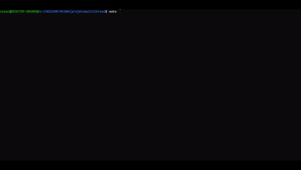

# Projeto Multithread

## Integrantes
Projeto desenvolvido na disciplina de Sistemas Operacionais (MC504), na Unicamp, durante o primeiro semestre de 2023, pelos seguintes alunos:
 * César Devens Grazioti - RA: 195641
 * João Miguel De Oliveira Guimarães - RA: 174358
 * Otavio Anovazzi - RA: 186331
 * Renan Luis Moraes De Sousa - RA: 243792

## Objetivo
O projeto tem o objetivo de ilustrar uma aplicação multithread utilizando semáforos e/ou mutex locks e variáveis de condição para sincronização. Em sua execução é ilustrado o estado global da aplicação e o processo em passos por meio de uma animação obtida com a impressão de caracteres ASCII.

## Introdução
Para desenvolvimento do projeto, utilizamos o capítulo 5.8 do livro *The Little Book of Semaphores* de Allen B. Downey. Neste capítulo é discutido o Problema da Montanha Russa e suas variações, além de apresentar dicas e ideias para sua resolução. Abaixo segue a solução e respectiva vizualização proposta por nós.

## Vídeo com descrição do problema abordado
[](https://youtu.be/cT9ZoRzvolI)

## Link com apresentação de slides do vídeo
[Slides](./assets/roller-coaster-presentation.pdf)

## Organização de pastas
```
.
├── assets/
│   ├── roller-coaster-intro.png
│   └── roller-coaster-presentation.pdf
└── src/
    ├── animation/
    │   ├── animation.c
    │   ├── animation.h
    │   └── animation_config.h
    ├── buffer/
    │   ├── buffer.c
    │   └── buffer.h
    ├── primitives/
    │   ├── primitives.c
    │   └── primitives.h
    ├── sprites/
    │   ├── sprites.c
    │   └── sprites.h
    ├── rollercoaster_config.h
    ├── rollercoasterlog.c
    ├── rollercoaster.c
    └── .gitignore
```

# O Problema da Montanha Russa

## Descrição do problema

Suponha que haja N passageiros e um trem de montanha-russa. Os passageiros esperam repetidamente para passear na montanha-russa. O trem tem capacidade para C lugares, C < N, mas o parque não deixa o trem sair da estação até que esteja cheio.

## Detalhes adicionais

- Passageiros podem solicitar embarque e desembarque;
- O trem pode sinalizar três diferentes estados: embarque, andando ou desembarque;
- Os passageiros não podem embarcar enquanto o trem sinalizar1que o embarque está disponível;
- O trem não pode partir até que os C passageiros tenham embarcado.
- Os passageiros não podem desembarcar até que o trem inicie o período de desembarque;

# Implementação
Para a solução do problema, utilizamos N threads para os passageiros e uma thread para o carro. Definimos também um número N_RUNS de voltas que o carro executa. Isso é análogo ao parque fechar e os passageiros irem embora (threads morrem).

## Semáforos, mutex locks e/ou variáveis de condição
- `mutex`: semáforo utilizado como mutex lock que protege a variável boarders para que somente 1 passageiro embarque no carinho por vez;
- `mutex2`: semáforo utilizado como mutex lock que protege a variável unboarders para que somente 1 passageiro desembarque no carinho por vez;
- `mutexPrint` semáforo utilizado como mutex lock que protege a trava a execução durante a animação do programa;
- `boarders`: variável utilizada para armazenar o número de passageiros que embarcou no trem;
- `unboarders`: variável utilizada para armazenar o número de passageiros que desembarcou no trem;
- `boardQueue`: semáforo utilizado para solicitar a entrada na montanha russa. Se comporta como fila;
- `unboardQueue`: semáforo utilizado para solicitar a saída da montanha russa. Se comporta como fila;
- `allAboard`: semáforo que indica quando o trem está completo com C passageiros;
- `allAshore`: semáforo que indica quando todos os C passageiros desembarcaram do trem.

## Thread do carro
A thread do carro fica em loop até que a condição de parada seja atingida: o número de voltas que o trem completou é exatamente igual a N_RUNS (hora de fechar o parque!). Inicialmente, ela posta que o embarque iniciou e espera até que todos os C passageiros estejam abordo. Posteriormente, podemos iniciar o passeio. Então, rodamos uma animação da montanha russa até o trem completar uma volta na tela. Quando ele volta a posição inicial, sabemos que ele completou uma volta e, portanto, devemos sinalizar que o desembarque iniciou. Esperamos que todos os passageiros estejam em terra e o processo se reinicia.

~~~c
void* f_car(void *v) {
    int runs = 0;

    while(runs < N_RUNS) {
        load();
        for (int i = 0; i < CAPACITY; i++) {
            sem_post(&boardQueue);
        }
        sem_wait(&allAboard);

        sem_wait(&mutexPrint);
        run();
        sem_post(&mutexPrint);

        unload();
        for (int i = 0; i < CAPACITY; i++) {
            sem_post(&unboardQueue);
        }
        sem_wait(&allAshore);

        runs++;
    }
    return NULL;
}
~~~

## Thread dos passageiros
Cada passageiro possui uma thread que é associada a um identificador id. Eles esperam até que o embarque se inicie (seja postado pelo carro) e também esperam sua vez por meio da sinalização do *mutex*. Uma vez conseguido esse acesso, o passageiro embarca no trem, é removido da fila e executado um print desse estado da aplicação. Se este for o último passageiro a embarcar no trem, é sinalizado que o carro está completo com C passageiros. Nesse instante, os passageiros que embarcaram estão num tour pela montanha russa e aguardam até que seja postada a liberação de desembarque. Além disso, é esperado que sua vez do desembarque ocorra, através do *mutex2*. Consequentemente, a medida que um passageiro desembarca, mostramos o estado atual da aplicação e reinserimos na fila de embarque. Quando o último passageiro desembarca, é sinalizado que o carro está totalmente vazio e pronto para um novo passeio. 

~~~c
void* f_passenger(void *v) {
    int id, stime, pos;

    while(1) {
        id = *(int*) v;
        stime = random() % 3;

        sleep(stime);

        // Waits to board
        sem_wait(&boardQueue);
        sem_wait(&mutex);

        pos = boarders;
        board(id, pos);

        boarders += 1;
        if (boarders == CAPACITY) {
            sem_post(&allAboard);
            boarders = 0;
        }
        sem_post(&mutex);

        // Waits to Unboard
        sem_wait(&unboardQueue);
        unboard(id, pos);

        sem_wait(&mutex2);
        unboarders += 1;
        if (unboarders == CAPACITY) {
            sem_post(&allAshore);
            unboarders = 0;
        }
        sem_post(&mutex2);
    }
    return NULL;
}
~~~

## Renderização

Para a animação, implementamos uma pequena biblioteca responsável por efetuar a renderização no terminal em tempo real.

# Especificações da bliblioteca

Armazena os caracteres em um buffer de saída e, somente quando requerido, efetua o "swap", mandando para o terminal.

O buffer unidimensional terminado em '\0' representa uma matriz bidimensional que armazena as informações dos chars da tela.
Onde a origem é dada no canto superior esquerdo; o X aumenta para a esquerda e o Y para baixo 

O tamanho da janela é personalizável, aceitando tamanhos bem grandes sem perda de performance.

Possibilita a inserção de strings ASCII unidimensionais ou bidimensionais em qualquer coordenada da tela, respeitando a quebra de linhas e formato.

Permite que haja sobreposição de strings, levando a criação de cenário e fundo.

# Animação

A animação consiste em uma montanha russa com um conjunto de pessoas esperando para entrar, quando a montanha russa enche o passeio se inicia,
quando ela volta os passageiros desembarcam em qualquer ordem voltando para a espera.

Para a animação, foram criados objetos para representar a espera de pessoas e os carrinhos:

* Carrinho: Possui uma posição dada em X e Y e renderiza de acordo com a pessoa que está dentro dele e sua posição. Para a animação, basta transladar a posição do carrinho e colocar o número do passageiro, ao efetuar o "swap" ele já estará na tela de acordo.
* Espera de pessoas: Cada pessoa é um thread que se responsabiliza por entrar no carrinho, quando ela entra, o carrinho é atualizado, portanto, alterando o seu estado na tela.
   
 Quando o carrinho lota, a montanha russa fecha e os carrinhos de deslocam até acabar o passeio, permitindo que os passageiros saiam e entrem novamente.

Com o auxílio da biblioteca implementada, a animação possui alguns parâmetros que podem ser alterados programaticamente:

* Número de pessoas: Aumenta a quantidade de pessoas na espera.
* Resolução da tela: Aumenta a resolução da tela, tanto a altura quanto a largura (Obs: Para melhores resultados espera-se que a largura seja múltiplo de 40).
* Número de voltas da montanha: Define quantas voltas a montanha-russa vai dar em um passeio.
* Capacidade do carrinho: Define quantos carrinhos vão ter na montanha-russa.
 
# Exemplo de execução

## Parametros customizados

* Número de pessoas: 15
* Resolução da tela: 160x40
* Número de voltas da montanha: 3
* Capacidade do carrinho: 5

## GIF da animação 


# Executando na sua máquina
Nesse tópico iremos ensinar um passo a passo de como baixar, configurar e executar o projeto no seu computador.

1. Acesse o link do repositório https://github.com/grazioti/MC504 contendo o projeto. Faça um clone para seu computador utilizando o comando `git clone https://github.com/grazioti/MC504` ou faça um **Download Zip** dos arquivos;
2. Abra em seu sistema de arquivos a pasta **projetomultithread**;
3. Segurando o botão Shift, clique com o botão direito do mouse nessa pasta e selecione "Abrir o shell do Linux aqui";
4. Clique com o botão direito na janela do shell e selecione "Propriedades";
5. Na aba **Layout**, busque por **Tamanho da Janela** e ajuste para que ela fique com a resolução informada no código `./scr/animation/animation_config.h`, isto é, mude para Largura = WITDH e Altura = HEIGHT. Isso é de extrema importância para evitar erros na visualização da animação. Por exemplo, se WITDH = 160 e HEIGHT = 40, ajuste o tamanho da janela do terminal para Largura = 160 e Altura = 40.
6. Com o shell aberto no diretório **projetomultithread**, execute o comando `make clean`.
7. Em seguida, faça `make`.
8. Que tal dar um passeio de montanha russa? Basta executar `./rollercoaster.x` para ver a animação do trabalho!
